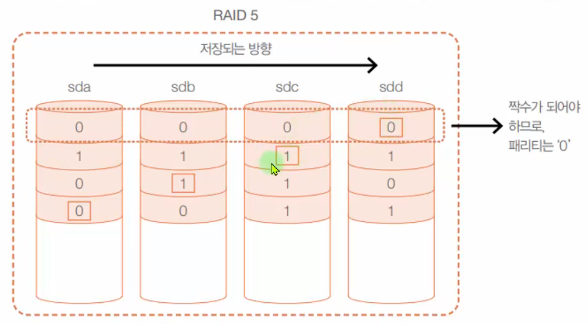

# RAID 정의 및 개념

## RAID 정의

- RAID(Redundant Array of Inexpensive Disks)는 여러 개의 디스크를 하나의 디스크처럼 사용
- 비용 절감 + 신뢰성 향상 + 성능 향상

## 하드웨어 RAID

- 하드웨어 제조업체에서 여러 개의 하드디스크를 가지고 장비를 만들어서 그 자체를 공급
- 좀 더 안정적이지만 고가임

## 소프트웨어 RAID

- 고가의 하드웨어 RAID의 대안
- 운영체제에서 지원하는 방식
- 저렴한 비용으로 좀 더 안전한 데이터의 저장이 가능

# 각 RAID 방식의 비교

- 단순 볼륨
- Linear RAID
  - 2개 이상 디스크 사용. 순차적으로(하나의 디스크가 차면 다음 디스크 사용) 저장. 디스크 추가 가능
- RAID 0
  - 2개 이상 디스크 사용. 여러 디스크를 동시에 저장. 가장 빠름. Stripping
- RAID 1
  - 2개 디스크 사용. 미러링. 동일한 데이터를 동시에 저장. 결함 허용 제공. 저장용량이 1/2임
- RAID 5
  - 3개 이상 디스크 필요. 결함 허용 제공. 하나의 디스크를 패리티 정보 사용
- RAID 6
  - 4개 이상 디스크 필요. 결함 허용 제공. 2개의 디스크를 중복 패리티 정보 사용. RAID 5의 개선

## Linear RAID

- 최소 2개의 하드디스크 필요
- 2개 이상 하드디스크를 1개의 볼륨으로 사용
- 앞 디스크부터 차례로 저장
- 100%의 공간효율성(비용 저렴)

## RAID 0

- 최소 2개의 하드디스크 필요
- 모든 디스크에 동시에 저장됨
- 100%의 공간효율성(비용 저렴)
- 신뢰성 낮음
- 빠른 성능을 요구하되, 혹시 전부 잃어버려도 큰 문제가 되지 않는 자료가 적당

## RAID 1

- 미러링이라 부름
- 데이터 저장에 두 배의 용량이 필요
- 결함 허용을 제공 = 신뢰성 제공
- 두 배의 저장 공간 = 비용이 두 배 = 공간 효율이 나쁨
- 저장 속도는 변함 없음
- 중요한 데이터를 저장하기에 적절

## RAID 5

- RAID 1의 안정성 + RAID 0의 공간 효율성
- 최소한 3개 이상의 하드디스크
- 오류가 발생할 떄 패리티를 이용해서 데이터를 복구
- 어느 정도 결함 허용을 해주면서 저장 공간의 효율도 좋음
- 디스크 개수 - 1의 공간을 사용(하나는 패리티)
- 디스크 2개가 고장나면 복구 못함

## RAID 6

- RAID 5 방식의 개선 버전
- 공간 효율은 RAID 5보다 떨어지지만, 2개의 디스크가 동시에 고장이 나도 데이터에는 이상이 없도록 함
- 최소 4개의 디스크 필요
- 성능은 RAID 5에 비해 약간 떨어짐

## RAID 1+0 = RAID 1 + RAID 0

- 신뢰성(안정성)과 성능(속도)이 동시에 뛰어난 방법
