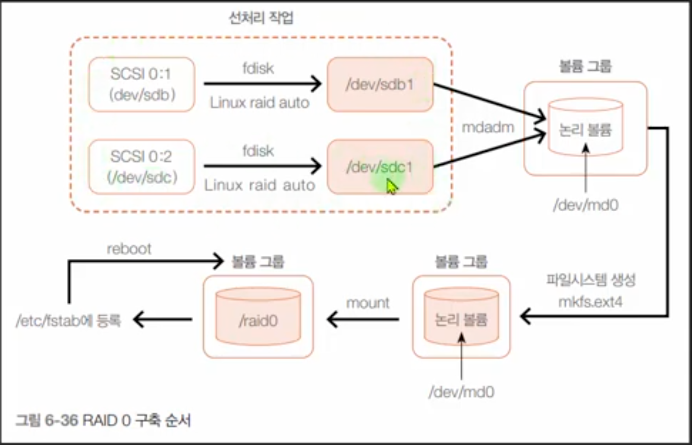
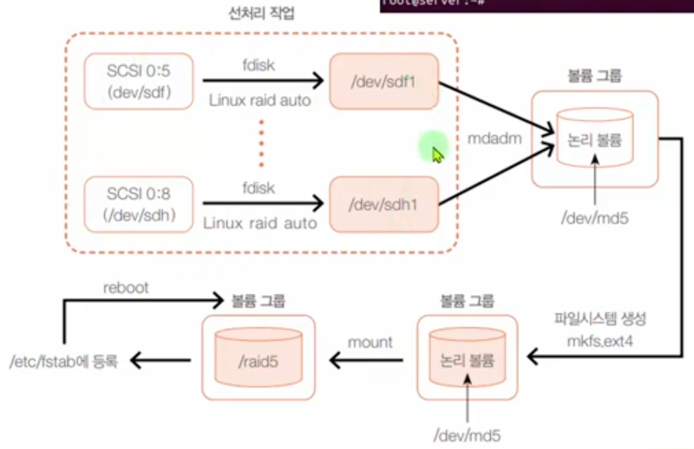

# RAID 0, 1, 5 구축

## RAID 0 구축

1. fdisk 명령어(`fdisk -l /dev/sdb`)로 디스크에 raid autodetect 파티션 생성되어 있는지 확인

2. `mdadm --create /dev/md0 --level=0 --raid-devices=2 /dev/sdb1 /dev/sdc1`

3. `mdadm --detail --scan`로 만들어진 RAID 확인

4. `mkfs.ext4 /dev/md0`로 파일시스템 포맷

5. `mkdir /raid0`로 마운트 경로 생성

6. `mount /dev/md0 /raid0`로 마운트

7. 재부팅 후에도 그대로 적용되도록 `/etc/fstab`에 등록

8. `vi /etc/fstab`

9. `/dev/md0  /raid0  ext4  defaults  0 0` 입력

10. `systemctl daemon-reload`로 재로드

11. `mdadm --detail /dev/md0`으로 RAID 상태 확인

## RAID 1 구축

1. `mdadm --create /dev/md1 --level=1 --raid-devices=2 /dev/sdd1 /dev/sde1`

2. `mkfs.ext4 /dev/md1`로 파일시스템 포맷

3. `mkdir /raid1`로 마운트 경로 생성

4. `mount /dev/md1 /raid1`로 마운트

5. `vi /etc/fstab`

6. `/dev/md1  /raid1  ext4  defaults  0 0` 입력

7. `systemctl daemon-reload`로 재로드

8. `mdadm --detail /dev/md1`으로 RAID 상태 확인

## RAID 5 구축

1. `mdadm --create /dev/md5 --level=5 --raid-devices=3 /dev/sdf1 /dev/sdg1 /dev/sdh1`

2. `mdadm --detail --scan`로 만들어진 RAID 확인

3. `mkfs.ext4 /dev/md5`로 파일시스템 포맷

4. `mkdir /raid5`로 마운트 경로 생성

5. `mount /dev/md5 /raid5`로 마운트

6. `vi /etc/fstab`

7. `/dev/md5  /raid5  ext4  defaults  0 0` 입력

8. `systemctl daemon-reload`로 재로드

9. `mdadm --detail /dev/md5`으로 RAID 상태 확인

## mdadm 추가 설정

1. `mdadm --detail --scan`하여 나오는 정보를 복사

2. `vim /etc/mdadm/mdadm.conf`

3. 맨 밑에 복사한 정보 붙여넣고 저장

4. `update-initramfs -u` 입력하여 적용

5. 재부팅하여 확인
